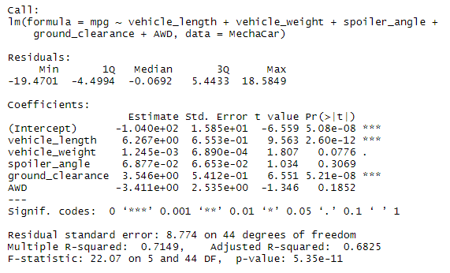
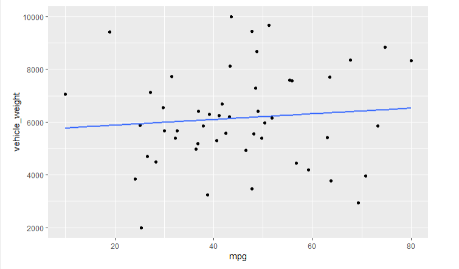
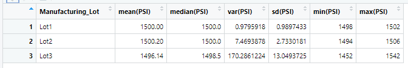
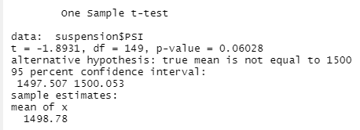
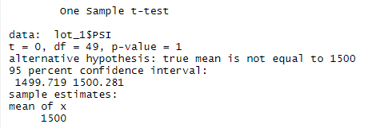
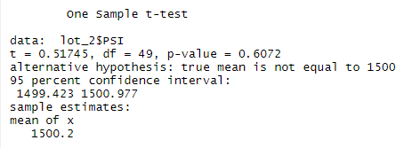
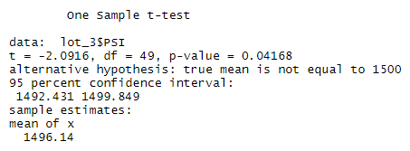

# MechaCar Statistical Analysis
The purpose of this analysis is to review the production data for insights that may help the manufacturing team by doing the following:

**I** Perform multiple linear regression analysis to identify which variables in the dataset predict the mpg of MechaCar prototypes;

**II** Collect summary statistics on the pounds per square inch (PSI) of the suspension coils from the manufacturing lots;

**III** Run t-tests to determine if the manufacturing lots are statistically different from the mean population; and

**IV** Design a statistical study to compare vehicle performance of the MechaCar vehicles against vehicles from other manufacturers.

## Linear Regression to Predict MPG

To predict the mpg of MechCar prototypes I used a linear model using multiples metrics, such as vehicle length, vehicle weight, spoiler angle, drivetrain, and ground clearance, and the results were the following:

Using the results, we can answer the next questions:

`(a)` Which variables/coefficients provided a non-random amount of variance to the mpg values in the dataset?

According to the results, vehicle length and ground clearance (as well as intercept) are statistically unlike to provide random amounts of variance to the mpg values, which means that these variables have a significant impact on the mpg values.

`(b)` Is the slope of the linear model considered to be zero? Why or why not?

No, because the interception starts in -1.040e+02 which means that we can deny the null hypothesis.

`(c)` Does this linear model predict mpg of MechaCar prototypes effectively? Why or why not?

Yes, due to the mpg being compared against multiple variables the multiple R-squared is 0.7149 which means that it is near 1.

The answers can be confirmed with this scatter plot:

## Summary Statistics on Suspension Coils

I used a summary statistics table to show: (i) the suspension coil’s PSI continuous variable across all manufacturing lots; and (ii) the PSI metrics for each lot: mean, median, variance, and standard deviation.

The design specifications for the MechaCar suspension coils dictate that the variance of the suspension coils must not exceed 100 pounds per square inch. 

As it is shown in the next table, the general variance of the suspension coils is 62.29356 pounds per square inch, which means that it does not exceed 100 psi.

Does the current manufacturing data meet this design specification for all manufacturing lots in total and each lot individually? Why or why not?

However, this design specification is accomplished in lot 1 and 2, but in lot 3 the variation is 170.2861224 psi, which means that is bigger than the spec needed. 

## T-Tests on Suspension Coils

Then I performed a t-test to determine if all manufacturing lots and each lot individually are statistically different from the population mean of 1,500 pounds per square inch.

In the following image the p-value es 0.06028 which means it is bigger than the significance of 0.05%, so in general all the manufacturing lots are statistically different from the mean of 1,500 psi. 

In lot 1 the p-value is equal to 1.

In lot 2 the p-value is equal to 0.6072

In lot 2 the p-value is equal to 0.04168, which is the one whose significance is less representative.

## Study Design: MechaCar vs Competition

To quantify how the MechaCar performs against the competition could be important to consider the following:

### What metric or metrics are you going to test?

•	Heat and air conditioning
•	Automatic vs manual transmission
•	Engine type.
•	Type of fuel
•	Safety features
•	Hauling capacity
•	Gadgets, apps, and connectivity
•	Comfort, space, and accessories
•	Relation value-price
•	Maintenance cost

### What is the null hypothesis or alternative hypothesis?

Null hypothesis. All the metrics beforementioned are not taken into consideration when the customer selects the car.
Alternative hypothesis. Most of the metrics beforementioned influence the customer decisions.

### What statistical test would you use to test the hypothesis? And why?

I probably would use a multiple linear regression model. Once I select the variables to collect, I would estimate the sample size based on how low of a significance level is necessary and how sensitive the measurements are.

### What data is needed to run the statistical test?

1. Public customer surveys of the last 5 years.

2. The areas of development in which the competition had invested more in the last 5 years.

3. Reports of the FTC, about the quality of the cars.
